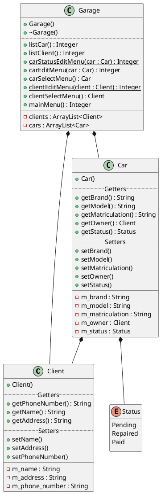
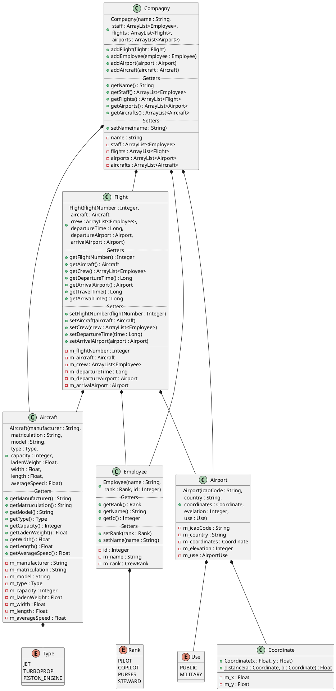

# TP 1

## Exercice 1

> Un garagiste souhaiterait mieux gérer son parc de voitures et sa clientèle. Jusqu'à maintenant, il notait tout dans de gros registres mais bien souvent il ne s'y retrouve plus. Il voudrait avoir un programme informatique pour gérer tout cela.  Ce programme doit permettre d'obtenir les **informations** d'un **client** particulier pour pouvoir le facturer. Il doit aussi permettre d'avoir un **état des lieux des voitures présentes**  au  garage,  leur  **marque**,  **modèle**  et  **immatriculation**,  ainsi  que  leur  **propriétaire**.  Le programme doit aussi permettre de **modifier** les **informations d'un client** particulier et de ressortir la **liste des voitures réparées**.

## Exercice 2

