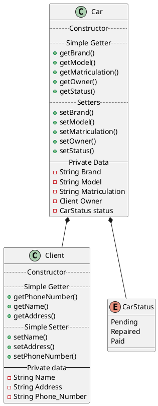

# Exercice 1

> Un garagiste souhaiterait mieux gérer son parc de voitures et sa clientèle. Jusqu’à maintenant, il notait tout dans de gros registres mais bien souvent il ne s’y retrouve plus. Il voudrait avoir un programme informatique pour gérer tout cela.  Ce programme doit permettre d’obtenir les **informations** d’un **client** particulier pour pouvoir le facturer. Il doit aussi permettre d’avoir un **état des lieux des voitures présentes**  au  garage,  leur  **marque**,  **modèle**  et  **immatriculation**,  ainsi  que  leur  **propriétaire**.  Le programme doit aussi permettre de **modifier** les **informations d’un client** particulier et de ressortir la **liste des voitures réparées**.

1. Surligner les noms dans la description
2. Identifier les noms pouvant être regroupées ensemble (même concept)
3. Etudier le lien entre les concepts identifiés et les objectifs que le programme doit remplir pour ne conserver que les concepts utiles
4. Décrireles  TAD à l’aide de fiches  techniques  (type  composite  représentant  le  concept  et opérations qui lui sont attachées)
5. Représenter les dépendances que les TAD entretiennent entre eux (graphe d’imbrication)
6. Implémenter le programme du garagiste en vous servant des TAD créés

