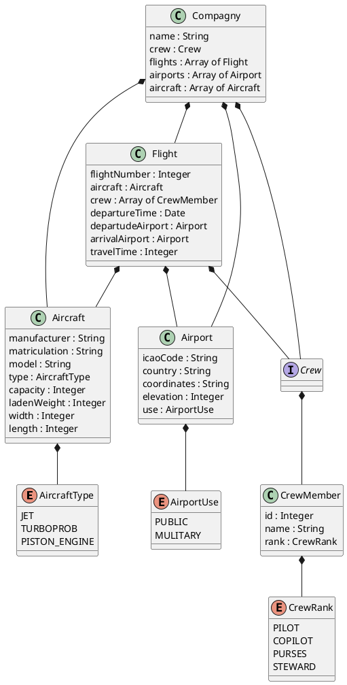

# Exercice 2

```plantuml
@startuml
enum AircraftType {
    JET
    TURBOPROB
    PISTON_ENGINE
}

enum AirportUse {
    PUBLIC
    MULITARY
}

enum CrewRank {
    PILOT
    COPILOT
    PURSES
    STEWARD
}

class Compagny {
    name : String
    crew : Crew
    flights : Array of Flight
    airports : Array of Airport
    aircraft : Array of Aircraft
}

class Aircraft {
    manufacturer : String
    matriculation : String
    model : String
    type : AircraftType
    capacity : Integer
    ladenWeight : Integer
    width : Integer
    length : Integer
}

class CrewMember {
    id : Integer
    name : String
    rank : CrewRank
}

class Airport {
    icaoCode : String
    country : String
    coordinates : String
    elevation : Integer
    use : AirportUse
}

class Flight {
    flightNumber : Integer
    aircraft : Aircraft
    crew : Array of CrewMember
    departureTime : Date
    departudeAirport : Airport
    arrivalAirport : Airport
    travelTime : Integer
}

interface Crew

Crew *-- CrewMember

Compagny *-- Airport
Compagny *-- Aircraft
Compagny *-- Crew
Compagny *-- Flight

Aircraft *-- AircraftType

CrewMember *-- CrewRank

Airport *-- AirportUse

Flight *-- Aircraft
Flight *-- Airport
Flight *-- Crew

@enduml
```
