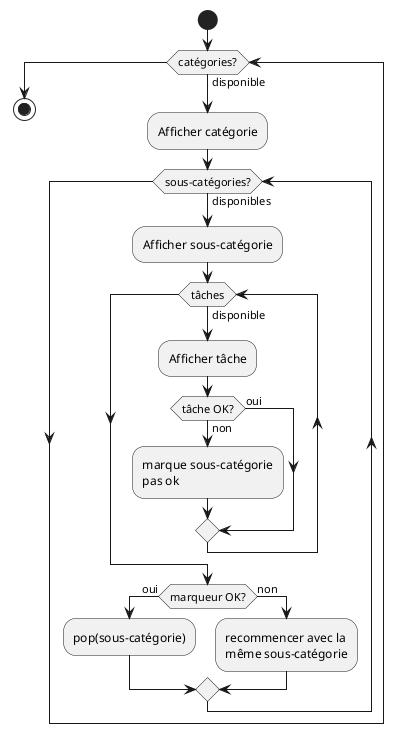
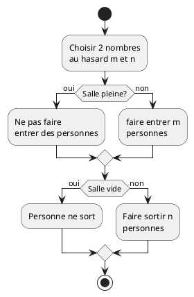

# Structures de données - TP2 - Haldi Hugo

Pour ce TP j'ai réalisé une bibliothèque de conteneurs (liste chaînée, pile, file) documentés dans des fichiers annexes.

## Exercice 1

1. Pour cet exercice, une pile peut être utilisée car avant de dépiler la catégorie, il faudra que toutes les sous-catégories soient dépilées, et pour chaque sous-catégorie, toutes les tâches devront être dépilées.
2. Diagramme ci-dessous:



3. Pour compiler le programme de cet exercice:

```shell
gcc -o Exercise_1 -Iinclude/ Exercise_1.c
```

## Exercice 2

1. La structure à utiliser est une file (queue).
2. Diagramme ci-dessous:



3. Pour compiler le programme:

```shell
gcc -o Exercise_2 -Iinclude Exercise_2.c forward_list.c queue.c
```