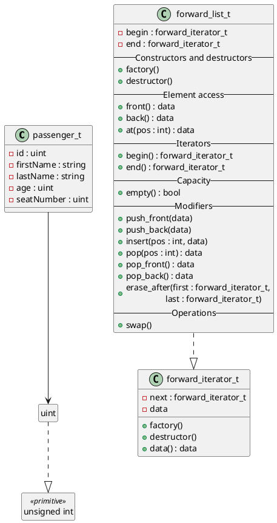

# Structures de Données - TP3

```plantuml
@startuml
class passenger_t {
    - id : uint
    - firstName : string
    - lastName : string
    - age : uint
    - seatNumber : uint
}

class uint

class "unsigned int" as unsigned_int <<primitive>>

hide uint circle
hide uint members
hide unsigned_int circle
hide unsigned_int members

uint ..|> unsigned_int

passenger_t --> uint

class forward_iterator_t {
    - next : forward_iterator_t
    - data
    + factory()
    + destructor()
    + data() : data
}

class forward_list_t {
    - begin : forward_iterator_t
    - end : forward_iterator_t
    -- Constructors and destructors --
    + factory()
    + destructor()
    -- Element access --
    + front() : data
    + back() : data
    + at(pos : int) : data
    -- Iterators --
    + begin() : forward_iterator_t
    + end() : forward_iterator_t
    -- Capacity --
    + empty() : bool
    -- Modifiers --
    + push_front(data)
    + push_back(data)
    + insert(pos : int, data)
    + pop(pos : int) : data
    + pop_front() : data
    + pop_back() : data
    + erase_after(first : forward_iterator_t,\n\
                  last : forward_iterator_t)
    -- Operations --
    + swap()
}

forward_list_t ..|> forward_iterator_t

@enduml
```
