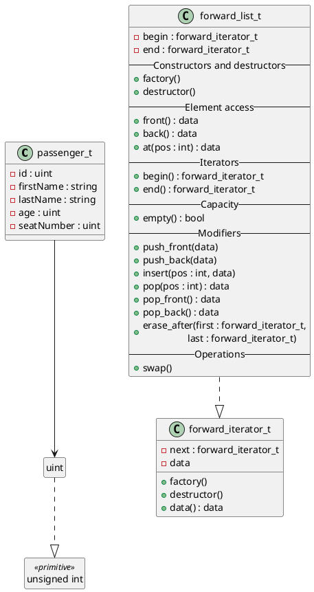

# Structures de Données - TP3

## Exercice 1



Pour compiler le code, il faut d'abord compiler les bibliothèques que l'on va utiliser aussi dans l'exercice suivant, puis l'exécutable principal:

```shell
gcc -Iinclude -c -fpic src/forward_list.c src/ex1.c
gcc -Iinclude -o ex1 src/main1.c ex1.o forward_list.o
```

## Exercice 2

Pour compiler le code, il faut d'abord compiler la bibliothèque `map`, puis compiler l'exécutable un utilisant les bibliothèques compilées dans le dernier exercice:

```shell
gcc -Iinclude -c -fpic src/map.c
gcc -Iinclude -o ex2 src/main2.c src/ex2.c src/map.c ex1.o forward_list.o
```
