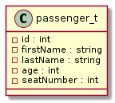
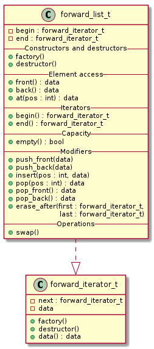
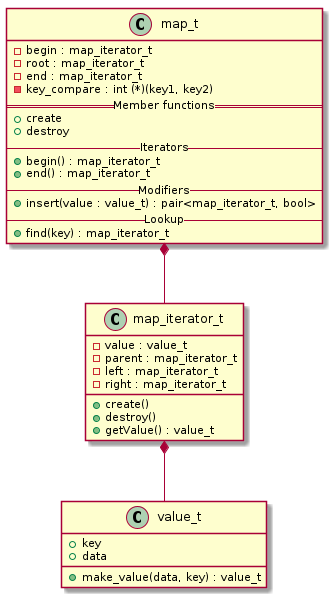
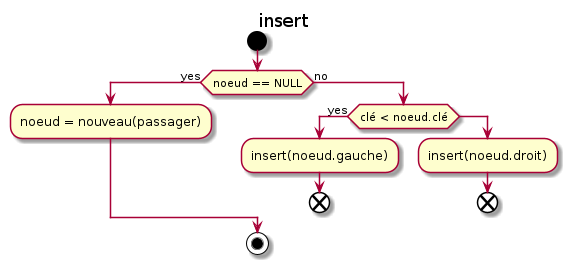
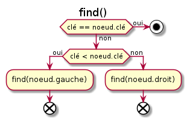
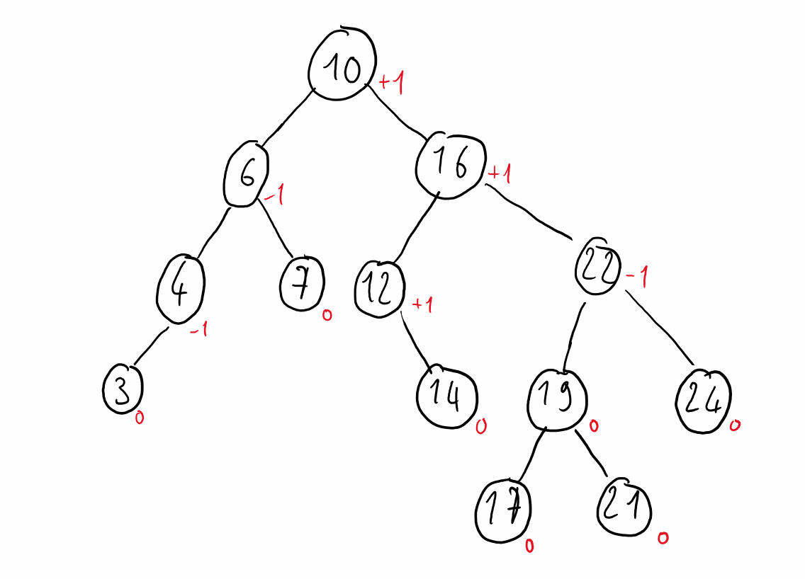
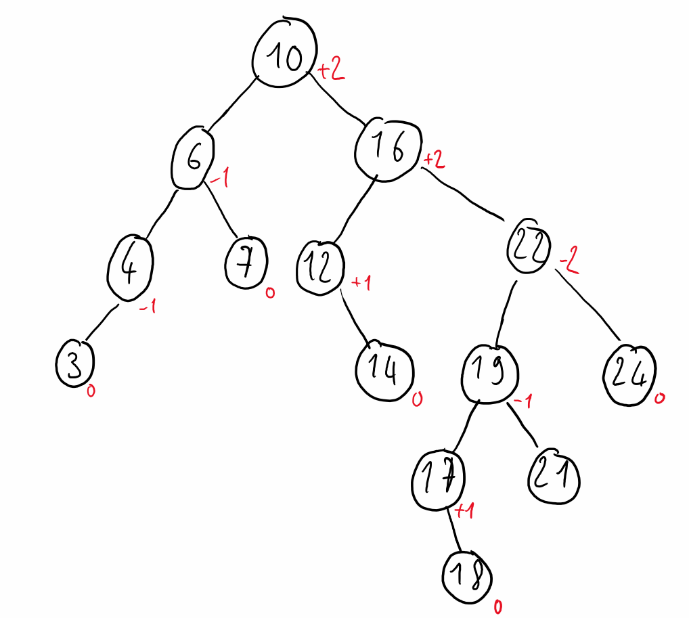
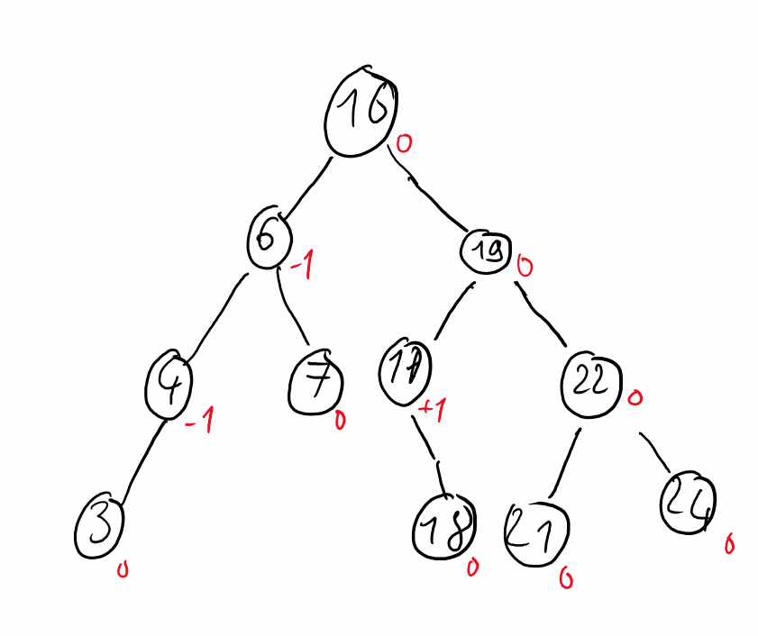

# Structures de Données - TP3

## Exercice 1

1. 
2. 
3. Pour compiler le code, il faut d'abord compiler les bibliothèques que l'on va utiliser aussi dans l'exercice suivant, puis l'exécutable principal:

    gcc -Iinclude -c -fpic src/forward_list.c src/ex1.c
    gcc -Iinclude -o ex1 src/main1.c ex1.o forward_list.o

## Exercice 2

1. Pour créer cet index, on va utiliser un arbre binaire:\
   
2. Puisqu'on doit trier les passagers par numéro de siège décroissant, la clé de tri doit être le numéro de siège.
3. \
   \
   
4. Pour compiler le code, il faut d'abord compiler la bibliothèque `map`, puis compiler l'exécutable un utilisant les bibliothèques compilées dans le dernier exercice:

    gcc -Iinclude -c -fpic src/map.c
    gcc -Iinclude -o ex2 src/main2.c src/ex2.c src/map.c ex1.o forward_list.o

## Exercice 3

1. Un arbre AVL est un arbre de tri tel que pour chaque noeud, la différence de hauteur entre le sous-arbre droit et le sous-arbre gauche n'exède pas 1 ou -1. Cela permet de conserver une complexité de O(n) pour la recherche.

|  |  |
| :------------------------------: | :--------------------------------------: |
|            Arbre AVL             |              Arbre non-AVL               |
   
2. L'équilibrage d'un arbre est le respect du critère AVL. Lors de l'insertion d'un nouvel élément, il se peut que l'arbre ne soit plus équilibré, c'est-à-dire que le facteur d'équilibrage soit supérieur à 1 ou inférieur à -1. La rotation permet donc de le rééquilibrer pour conserver la complexité d'un arbre AVL.
3. Les rotations permettent de diminuer la hauteur des sous-arbres lorsque le facteur d'équilibrage dépasse 1 ou -1.\
   Lorsque le facteur d'équilibrage d'un noeud est supérieur à 1, on applique la rotation simple droite car c'est le sous-arbre droit qui possède une hauteur trop élevée.\
   Lorsqu'il est inférieur à -1, on applique la rotation simple gauche.\
   La rotation double est une rotation simple effectué 2 fois de suite dans les cas où le facteur d'équilibrage dépasse 2 ou -2.\
   Dans l'exemple précédent il faut appliquer une rotation simple gauche pour rééquilibrer l'arbre, on obtient alors:\
   
