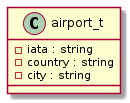
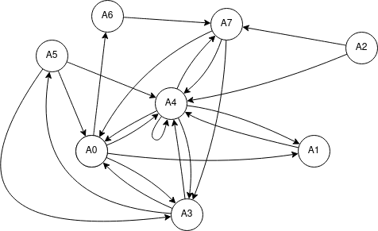
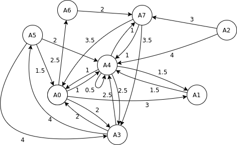

# Structures de Données - TP4

## Exercice 1

1.  {width="130px"}

2.  | Nom du sommet | Code IATA | Ville    | Pays        | Liaisons                          |
    |---------------|-----------|----------|-------------|-----------------------------------|
    | A0            | LHR       | Londres  | Royaume-Uni | Paris Tokyo Berlin Madrid         |
    | A1            | BER       | Berlin   | Allemagne   | Paris                             |
    | A2            | MXP       | Milan    | Italie      | Genève Paris                      |
    | A3            | NRT       | Tokyo    | Japon       | Montreal Paris Londres            |
    | A4            | CDG       | Paris    | France      | Paris Londres Berlin Tokyo Geneve |
    | A5            | YUL       | Montreal | Canada      | Paris Tokyo Londres               |
    | A6            | MAD       | Madrid   | Espagne     | Geneve                            |
    | A7            | GVA       | Genève   | Suisse      | Tokyo Paris Londres               |

3.  {width="476px"}

```{=tex}
\pagebreak
```
4.  -   Matrice d'adjacence:

        $A=\begin{bmatrix} 0 & 1 & 0 & 1 & 1 & 0 & 1 & 0\\ 0 & 0 & 0 & 0 & 1 & 0 & 0 & 0\\ 0 & 0 & 0 & 0 & 1 & 0 & 0 & 1\\ 1 & 0 & 0 & 0 & 1 & 1 & 0 & 0\\ 1 & 1 & 0 & 1 & 1 & 0 & 0 & 1\\ 1 & 0 & 0 & 1 & 1 & 0 & 0 & 0\\ 0 & 0 & 0 & 0 & 0 & 0 & 0 & 1\\ 1 & 0 & 0 & 1 & 1 & 0 & 0 & 0 \end{bmatrix}$

    -   Liste d'adjacence:

        | Sommet | Liaisons       |
        |--------|----------------|
        | A0     | A1 A3 A4 A6    |
        | A1     | A4             |
        | A2     | A4 A7          |
        | A3     | A0 A4 A5       |
        | A4     | A0 A1 A3 A4 A7 |
        | A5     | A0 A3 A4       |
        | A6     | A7             |
        | A7     | A0 A3 A4       |

5.  $A^p$ donne une matrice avec $t_{i,j}$ le nombre de chemins de longueur $p$ entre les sommets $i$ et $j$.

6.  -   Le DFS (Depth First Search) est un parcours en profondeur d'un arbre, c'est-à-dire qu'il va d'abord atteindre le noeud le plus profond possible non parcouru, avant de retourner un pas en arrière quand il rencontre un cul-de-sac. Il permet de déterminer la connexité d'un graphe, ses composantes connexes ou si il a des cycles.

    -   Le BFS (Breadth First Search) est un parcours en largeur, à chaque noeud on va d'abord explorer tous ses voisins avant de passer à la profondeur suivante. Il permet de déterminer le chemin le plus court entre 2 sommets et trouver les composantes connexes d'un graphe.

## Exercice 2

1.  {width="476px"}
2.  Pour trouver le chemin le plus court entre deux sommets, on peut utiliser le BFS car il visite tous les noeuds d'un graphe en ne passant qu'une fois pas noeud. Il suffit ensuite de ne retenir à chaque fois que le chemin avec le poids de parcours le plus faible.

## Exercice 3

1.  Le programme lit d'abord le fichier `aeroports.txt` ligne par ligne et crée un noeud contenant un aéroport et une liste de liaisons et ajoute ce noeud dans une liste d'aéroports. Ensuite le programme lit `liaisons.txt` et à chaque ligne, on ajoute dans la liste de liaisons de l'aéroport courant toutes le liaisons de la ligne courante. On obtient alors une liste de noeuds contenant chacun un aéroport et une liste de liasons (chaque liaison pointant vers un noeud d'aéroport).
2.  Les procédures BFS et DFS sont implémentées dans `main.c` dans les procédures `bfs` et `dfs`.
3.  L'algorithme de recherche de plus court chemin utilise le BFS avec l'algorithme de Dijkstra. À chaque fois qu'on visite un noeud, on définit par quel noeud on l'a atteint, et la première itération à atteindre le noeud recherché, on retourne le noeud recherché avec un noeud parent jusqu'au noeud de départ.

Pour compiler l'implémentation:

        gcc -Iinclude/ src/*.c -o TP4

Lors de l'exécution du programme, la liste des aéroports et leur liaisons va être affiché, et on va demander à l'utilisateur d'entrer une ville de départ et d'arrivée pour calculer le chemin le plus court entre ces deux villes.
